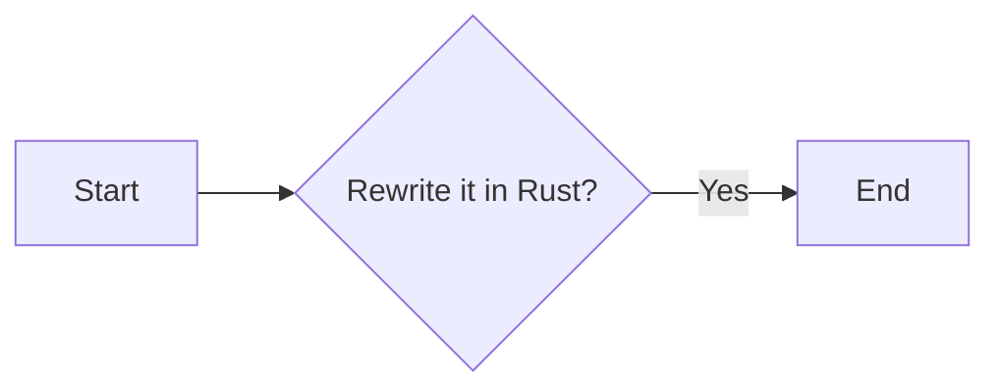
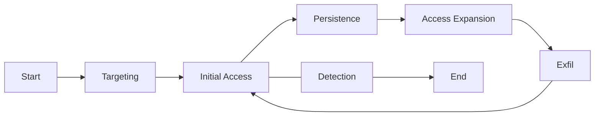

## RustOps 

*Malware Development Using the Rust Programming Language* 


---
# whoami

Jose Plascencia

* 34 years old
* Security Consultant @ DirectDefense
* Mentor
* Marathon runner
* Red and Blue Teaming, Windows Internals, Rust dev, Memory Safety, Reverse Engineering

Notes:
Show of hands
- First timers?
- Students?
- Red Teamers?
- Blue Teamers? 

---
## **Disclaimer**

> [!warning] 
> 1. Opinions expressed are solely my own and do __not__ express the views or opinions of my employer.
>2. This presentation has __not__ been reviewed or approved by the Rust Foundation. 
>3. I am __not__ in a position to endorse any software vendor. 
>4. The following content **is** for personal development. 


---
# What?
**Goal**: To arm you with enough knowledge to use Rust in your Red Team engagements and exercises. 

**RustOps Starterpack**: 
Obsidian notebook, slides and other workshop content will be made available after the presentation.

---
#### Why Rust?
Memory Safety, Security & Reliability, No GC, Concurrent and Parallel Programming, Cross-Platform Support, Crustacean Community, Modern Language Features, ...


Note: 
- In the context of malware dev. there are detection challenges...more on that later
- CVE-2024-24576 - CVSS 10
	- "The Rust Security Response WG was notified that the **Rust standard library did not properly escape arguments when invoking batch files (with the bat and cmd extensions)** on Windows using the Command API,"

---
### Goals of this talk
- [ ] Malware Fundamentals
- [ ] Rust Fundamentals
- [ ] Guidance
	- [ ] Network Communication
	- [ ] Bad OpSec
	- [ ] OpSec
- [ ] Call to action

---

### Malware Fundamentals

* Malware is used to support the Computer Network Exploitation (CNE) life cycle.
	* Ideal operational CNE life cycle from *Network Attacks & Exploitation: A Framework* by [Matthew Monte](https://onlinelibrary.wiley.com/doi/book/10.1002/9781119183440)



* [MITRE ATT&CK® Matrix for Enterprise](https://attack.mitre.org/#) The "Why" and "How" of CNE through documented real-world Tactics, techniques, and procedures (TTPs).

Note: 
* Start, Targeting, IA, Persistence, Access Expansion, Exfil, Detection, End
* Decoupling
* Common C2 frameworks
* Motives: Destruction, Sabotage, Financial gain
* As Red Teamers we want to test the Blue Team. 

---
### Malware Types
[](https://mermaid.live/edit#pako:eNpdUltv0zAU_ivWeUBMCqhXaPJW2CYQDKG2YtKUl0N8lnqzfSzbgYWq_x13SZppfvpuOhfbB6hYEhRglJUGnbhB_Rc9lVak80v5JnTwG3lLWmyY46OKvfildeT_qMBefDVOox2MS88uWR35zigHnMpLroaSrea6HqxPHC3FHmP1KJl751ada23IcCSxrioKQew8P6AVbzfr3UUfZW_6GdZyXGTr2pFs0AY2Jy464bNXhl6EI6EmHwazdZE7PPKHNKCy9Ws53eJZvVaadJqyX5x_J943qFKvsd_Vk9OsohiLbfek9elh-hF-XIkdsw5j4ifZSCGKN-lGpNgRms6DDAx5g0qmNz2ctBLingyVUCQo6R4bHUso7TFFsYm8bW0FRfQNZeC5qfdQ3KMOiTVOYqRLhbVHc1ZJqsj-pvs1z58nA4f2jnnMJA7FAZ6geLd4n-cfJ6vJZDafL_PVYrbMoO30xTTPl7PpYjJfzVYfjhn8e64xPf4H3K7OPA)

---
### Rust Malware History

Threat Actors:
- RustDown
- BlueNoroff, RustBucket
- COLDRIVER
- WildCard
- BlackCat
- RansomExx

[Awesome Rust Malware Gallery ](https://github.com/cxiao/rust-malware-gallery)

Note: 
Notable cases where Rust was used for cyberattacks
* Agenda
* BlackCat
* Buer loader
* Hive
* SSLoad
* We'll cover bad opsec later 

---
# Rust Fundamentals


---
### Rust Development Environment 
 * [VMware Workstation Pro: Now Available Free for Personal Use](https://blogs.vmware.com/workstation/2024/05/vmware-workstation-pro-now-available-free-for-personal-use.html)
 * [Windows Dev Instance](https://developer.microsoft.com/en-us/windows/downloads/virtual-machines/)
 * [VS Code](https://code.visualstudio.com)
 * [Set up your dev environment on Windows for Rust](https://learn.microsoft.com/en-us/windows/dev-environment/rust/setup)
	 * [Visual C++ Build Tools](https://visualstudio.microsoft.com/visual-cpp-build-tools)
	 * [Rustup: The Rust Installer](https://rustup.rs)

`rustc --version ; cargo --version`

Ready? LFG! 

Notes:
* rust-analyzer for VS Code
* CodeLLDB
---
### Rust Terminology
* Crate
* Executable Crate
* Library Crate
* External Crate
* Packages
* Modules
* Cargo.toml
* Cargo.lock
* '.rs' Extension 
Notes:
- [ ] Cargo.toml is the manifest and config file 
- [ ] Cargo.lock is a record of all dependencies 
- [ ] Rust source file
---
### Cargo & Crates

* [Cargo](https://doc.rust-lang.org/cargo/getting-started/installation.html): The Rust package manager 
* [RTFM](https://doc.rust-lang.org/cargo/commands/cargo-run.html) (Yes, there is a book on Cargo.)
* [Crates.io](https://crates.io): The Rust community’s crate registry  

New project:
```cargo new {{project_name}}``` 

Create a new directory under the project:

`mdkir examples ; touch examples/demo.rs`

Run example:
`cargo run --example demo`

Build project:
`cargo build`

---
Run project within the directory :
`cargo run`


Generate HTML documentation from comments:

`cargo doc`

Alt. generate an executable from a single .rs file using the Rust compiler:

`rustc examples/demo.rs`

Notes:
- [ ] Note there are several flags under the run command
---
### Rust Project Structure
```bash
❯ ls *
Cargo.lock      Cargo.toml
examples:
demo.rs
src:
main.rs
target:
CACHEDIR.TAG    debug
❯ cargo run
    ... `removed for brevity`
Hello, world!
❯ cargo run --example demo    
    Finished `dev` profile [unoptimized + debuginfo] target(s) in 0.06s
     Running `target/debug/examples/demo`
Hello, from the example dir!
```
Notes:  
- [ ] Explain target debug
- [ ] Cargo.toml is the manifest and config file 
- [ ] Cargo.lock is a record of all dependencies 
- [ ] Rust source file

---
# Rust Basics

```rust
// <--crate imports
//entry point function
//`fn` denotes a function and the curly braces demarcates a function block. 
// V important concept for lifetimes
fn main() {
//`println!` is a macro. 
println!("Hello, from the example dir!");

let message = "Hello";
let name = "🦀";
println!("{:?}, {:?}",message,name);

}
```

Notes: 
- [ ] Macros provides the compatibility of a variadic function. 
- [ ] The `println!` macro prints to standard output and appends a linefeed to the formatted output.
- [ ] Check out the `asm!`
- [ ] The `:?` placeholder renders the dev view of the value. Great for debugging. 
	- [ ] Requires the debug trait `#[derive(Debug)]` over a struct, `println!` will pretty print the contents of the struct making it easier for the dev.
- [ ] There are format specifier as well. e.g., {:p} for a pointer address

---
### Important Concepts 🥲

Closures, Collections, Control Flow, Enums, Functions, Generics, Macros, __Memory__, Modules, Patterns, Structures, Threads, Traits, Variables, __Lifetimes__, __Ownership__, __References__

[The Rust Book ](https://doc.rust-lang.org/stable/book/)

Offline copy:
`rustup doc --book`

[The Rust Programming Language, 2nd Edition](https://nostarch.com/rust-programming-language-2nd-edition)

Notes:
- [ ] The ones in bold are imperative to understand. 

---
### Native Windows APIs
Cargo.toml
```
[dependencies]
windows = { version = "0.58.0, features = ["Win32_Foundation","Win32_UI_Shell" "Win32_UI_WindowsAndMessaging"] }
```
main.rs
```rust
use windows::{core::*, Win32::UI::Shell::*, Win32::UI::WindowsAndMessaging::*};

fn main() {
	//No memory safety guarantees!
    unsafe {
        MessageBoxA(None, s!("Ansi"), s!("World"), MB_OK);
    }
}
```

[Rust for Windows, and the _windows_crate](https://learn.microsoft.com/en-us/windows/dev-environment/rust/rust-for-windows)

[MSDN](https://learn.microsoft.com/en-us/windows/win32/api/winuser/nf-winuser-messageboxa)

Notes:
- [ ] Note some Windows crates are safe
- [ ] Using unsafe function blocks unlocks super powers or control over raw pointers, access to other unsafe functions, traits, etc. 
- [ ] MSDN can be used to learn more about functions and how arguments should be implemented using Rust.

---
### Network Communication Channels

* HTTP/HTTPS
	* Cloud: AWS, GCP, Azure, ...
	* Web services: Social Media Platforms
* DNS
* SMTP/IMAP
* FTP/SFTP
* P2P
* TOR
* TCP
* UDP
* ICMP

---
### HTTP/HTTPS

- Rust
	* minreq
	* reqwest
	* hyper
	* curl-rust

- Native
	* Windows Internet (WinINet)
	* WinHTTP

Notes:
- Mention Headers, hardcoded user agent, for fingerprinting and classifying malware
- Mention URL and API endpoints, e.g. 'api/update', 'api/v1/'
- Static config will result in trivial detection
---

GET
```rust
//import reqwest w/ "json" features
//import tokio with "full" features
//include main

let body = reqwest::get("http://httpbin.org/get")     
		.await?     
		.text()     
		.await?;  
println!("body = {body:?}");

```

POST
```rust

let client = reqwest::Client::new(); 
let res = client.post("http://httpbin.org/post")     
	.body("POST Malone")     
	.send()     
	.await?;
```
---
### Blue Team Challenges & Red Team Considerations


Buer C2 URLs

* "Project 0xA11C" by Nicole Fishbein, Juan Andrés Guerrero-Saade (Presented at BlackHat 2024)
	* Methodology and tools for Rust malware RE

Notes: 
- Complexity: Rust does not have a stable Application Binary Interface (ABI)
	- Memory safe operations or anything that could cause the app to panic. 
- "A Rust developer can create a program without depending on the Rust standard library and only import system libraries as needed" BinaryDefense
- Strategy
- Detection points...

---
### Bad OpSec
---
### Debugging Information
Strings revealing: Hostnames, URLs, Rust Crates & Modules, PDB File Path 

Notes: Remove debugging information and symbol tables
- Alt. https://github.com/BinaryDefense/GhidraRustDependenciesExtractor

---
### Windows API Calls || Injection Techniques

Freeze.rs 

---
### High entropy

Note: 
- These images are not my own. Please see referenced article online.
- Shannon Entropy - The measure of randomness

---
### OpSec

- Obfuscation: 
	- Obfuscator LLVM ([OLLVM]([https://github.com/joaovarelas/Obfuscator-LLVM-16.0](https://github.com/joaovarelas/Obfuscator-LLVM-16.0)))
	- [Goldberg](https://crates.io/crates/goldberg)
- VEH: 
	- Control Flow Manipulation (`RtlAddVectoredExceptionHandler`)
- Direct and Indirect/Dynamic syscalls
	- Evading hooks on _ntdll.dll_ functions
- Hooking & Unhooking: 
	- API interception and manipulation
	- Trampoline
---
- Process Injection
	- Process Hollowing
	- DLL injection
	- Module stomping
	- Asynchronous Procedure Calls (APC) Injection 
- Patching: 
	- ETW
	- AMSI
- Encoding
	- Base64
	- Hex
	- URL
	- ROT13
- Encryption: 
	- XOR
	- AES
	- RC4
	- LZMA
---
### Exercises, Resources, Shout-outs
Community Projects
- https://github.com/joaoviictorti/RustRedOps/
- https://github.com/BlackSnufkin/Rusty-Playground
- https://github.com/Whitecat18/Rust-for-Malware-Development
- https://github.com/trickster0/OffensiveRust
- https://github.com/hakaioffsec/coffee
- https://github.com/Nariod/RustPacker
- https://github.com/janoglezcampos/rust_syscalls
- https://github.com/b1nhack/rust-shellcode
- https://github.com/pumpbin/pumpbin
- https://github.com/g0h4n/syscalls-rs
---

### Researchers
- https://github.com/Idov31
- https://github.com/trickster0
- https://github.com/Kudaes
- https://github.com/memN0ps/
- https://github.com/hakaioffsec

Documented Evasion Techniques (Mostly C++)
https://www.unprotect.it

Notes: Use these resources to learn more and implement your capability.

---
### Call to Action


*There are a thousand hacking at the branches of evil to one who is striking at the root.* 

― Henry David Thoreau, Walden, or Life in the Woods

Note: 
* I hope you found this useful and fun. 
* Why am I sharing this with you? 
	* I figured this would be a fun way to learn the language.
	* To gamify it
* Efforts to translate legacy code. DARPA - Project TRACTOR 
	* "The TRACTOR **program aims to automate the translation of legacy C code to Rust**. The goal is to achieve the same quality and style that a skilled Rust developer would produce, thereby eliminating the entire class of memory safety security vulnerabilities present in C programs. This program may involve novel combinations of software analysis, such as static analysis and dynamic analysis, and machine learning techniques like large language models."

---
# End

Feel free to contact me via [Signal](https://signal.me/#eu/phA40m7c7_mTb_hUrkeqXjeFW-JqeOR4v3XxvIYZIxTo0IrIXt9Dt5KKIafik1wZ)

**Github**: grim3

![[Pasted image 20240810105752.png]]

---
### Appendix

Detection Tools/ OpSec Validation
- [ ] [VirusTotal](https://www.virustotal.com/gui/home/upload)
- [ ] [ThreatCheck](https://github.com/rasta-mouse/ThreatCheck)
- [ ] [PE-sieve](https://github.com/hasherezade/pe-sieve)
- [ ] [mal_unpack](https://github.com/hasherezade/mal_unpack)
- [ ] [Moneta](https://github.com/forrest-orr/moneta)
- [ ] [Beaconeye](https://github.com/CCob/BeaconEye)
- [ ] [MalMemDetect](https://github.com/waldo-irc/MalMemDetect)
- [ ] [SignatureScanner](https://github.com/Zer0Mem0ry/SignatureScanner)
- [ ] [YARA](https://github.com/VirusTotal/yara)
- [ ] [Capa-Rules](https://github.com/mandiant/capa-rules)
- [ ] [SpeakEasy](https://github.com/mandiant/speakeasy )

---

- Books
	- [ ] Evading EDR by Matt Hand
	- [ ] Windows Security Internals by James Forshaw
	- [ ] Windows Internals, Sixth Edition, Part 1 By David A. Solomon Mark E. Russinovich and Alex Ionescu
	- [ ] Windows Internals, Part 2, 7th Edition By Andrea Allievi, Alex Ionescu, David A. Solomon, et.al. 

---
#### Sysmon

```powershell
[Net.ServicePointManager]: :SecurityProtocol = [Net.SecurityProtocolType]:: T1s12
$url = "https://download.sysinternals.com/files/Sysmon.zip"
$dest = "$env:APPDATA\Sysmon.zip"
Invoke-WebRequest -Uri $url -OutFile $dest
Expand-Archive -Path $dest -DestinationPath "$env:APPDATA\"
```

```Windows Command Prompt
sysmon -accepteula -i
```

---
### Procmon

```powershell
[Net.ServicePointManager]: :SecurityProtocol = [Net.SecurityProtocolType]:: T1s12
$url = "https://download.sysinternals.com/files/ProcessMonitor.zip"
$dest = "$env:APPDATA\ProcessMonitor.zip"
Invoke-WebRequest -Uri $url -OutFile $dest
Expand-Archive -Path $dest -DestinationPath "$env:APPDATA\"
```

---
#### Binary Ninja (binja)
```powershell
[Net.ServicePointManager]: :SecurityProtocol = [Net.SecurityProtocolType]:: T1s12
$url = "https://cdn.binary.ninja/installers/binaryninja_free_win64.exe"

$dest = "$env:APPDATA\binaryninja_free_win64.exe"
Invoke-WebRequest -Uri $url -OutFile $dest
```

---
#### WinDbg
```powershell

[Net.ServicePointManager]: :SecurityProtocol = [Net.SecurityProtocolType]:: T1s12

$winDbgUrl = "https://windbg.download.prss.microsoft.com/dbazure/prod/1-2306-12001-0/windbg.msixbundle"
$windbgdirectoryPath = "C:\Users\dev\windbgx"
New-Item -ItemType Directory -Path $windbgdirectoryPath
Invoke-WebRequest -Uri $winDbgUrl -OutFile "$windbgdirectoryPath\windbg.msixbundle"
Add-AppxPackage -Path "$windbgdirectoryPath\windbg.msixbundle"
```
---
### Credits

[Obsidian](https://obsidian.md) is the private and flexible writing app that adapts to the way you think.

[Advanced Slides](https://github.com/MSzturc/obsidian-advanced-slides)  is an open source plugin for [Obsidian](https://obsidian.md/) that allows you to create [reveal.js](https://revealjs.com/) based presentations in Obsidian. With this tool anyone who is able to create a note in Obsidian can also create a beautiful presentation.

The artists and researchers for their tireless work.

---